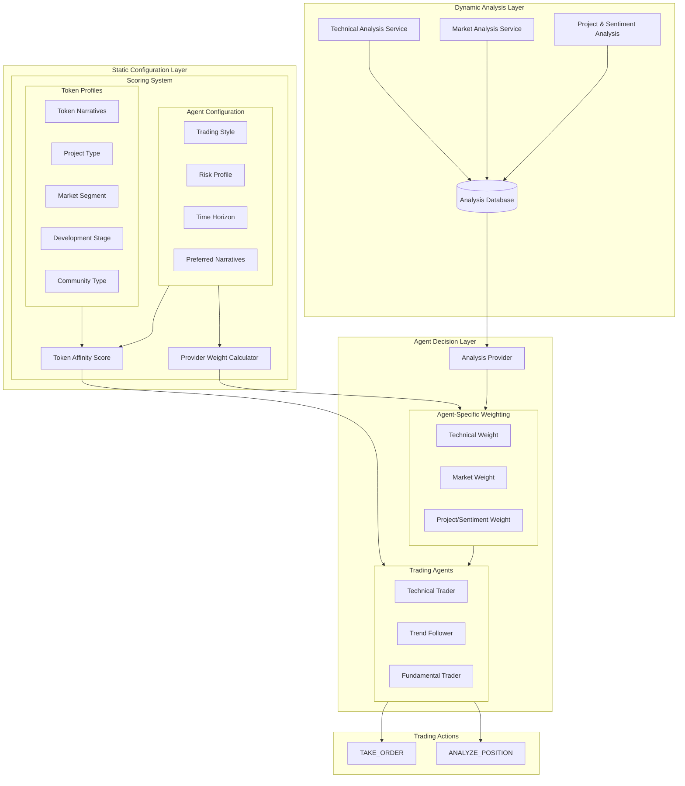

```mermaid
flowchart TD
    subgraph StaticConfig["Static Configuration Layer"]
        direction TB
        subgraph TokenProfiles["Token Profiles"]
            TP1[Token Narratives]
            TP2[Project Type]
            TP3[Market Segment]
            TP4[Development Stage]
            TP5[Community Type]
        end
        
        subgraph AgentConfig["Agent Configuration"]
            AC1[Trading Style]
            AC2[Risk Profile]
            AC3[Time Horizon]
            AC4[Preferred Narratives]
        end

        subgraph Scoring["Scoring System"]
            direction TB
            S1[Token Affinity Score]
            S2[Provider Weight Calculator]
            
            TokenProfiles --> S1
            AgentConfig --> S1
            AgentConfig --> S2
        end
    end

    subgraph DynamicAnalysis["Dynamic Analysis Layer"]
        direction TB
        Technical["Technical Analysis Service"]
        Market["Market Analysis Service"]
        ProjectSentiment["Project & Sentiment Analysis"]
        
        Technical --> Analysis[(Analysis Database)]
        Market --> Analysis
        ProjectSentiment --> Analysis
    end

    subgraph AgentLayer["Agent Decision Layer"]
        Provider["Analysis Provider"]
        Analysis --> Provider

        subgraph WeightingSystem["Agent-Specific Weighting"]
            W1[Technical Weight]
            W2[Market Weight]
            W3[Project/Sentiment Weight]
        end

        S2 --> WeightingSystem
        Provider --> WeightingSystem

        subgraph Agents["Trading Agents"]
            Agent1[Technical Trader]
            Agent2[Trend Follower]
            Agent3[Fundamental Trader]
        end

        S1 --> Agents
        WeightingSystem --> Agents
    end

    subgraph Trading["Trading Actions"]
        T1[TAKE_ORDER]
        T2[ANALYZE_POSITION]
    end

    Agents --> T1
    Agents --> T2
```