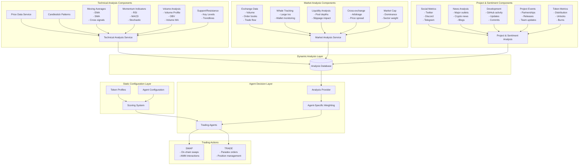

```mermaid
flowchart TD
    subgraph StaticConfig["Static Configuration Layer"]
        direction TB
        TokenProfiles["Token Profiles"]
        AgentConfig["Agent Configuration"]
        Scoring["Scoring System"]
        TokenProfiles --> Scoring
        AgentConfig --> Scoring
    end

    subgraph TechnicalComponents["Technical Analysis Components"]
        direction TB
        TC1["Price Data Service"]
        TC2["Candlestick Patterns"]
        TC3["Moving Averages\n- EMA\n- SMA\n- Cross signals"]
        TC4["Momentum Indicators\n- RSI\n- MACD\n- Stochastic"]
        TC5["Volume Analysis\n- Volume Profile\n- OBV\n- Volume MA"]
        TC6["Support/Resistance\n- Key Levels\n- Trendlines"]
        
        TC1 --> Technical
        TC2 --> Technical
        TC3 --> Technical
        TC4 --> Technical
        TC5 --> Technical
        TC6 --> Technical
    end

    subgraph MarketComponents["Market Analysis Components"]
        direction TB
        MC1["Exchange Data\n- Volume\n- Order books\n- Trade flow"]
        MC2["Whale Tracking\n- Large txs\n- Wallet monitoring"]
        MC3["Liquidity Analysis\n- Pool depths\n- Slippage impact"]
        MC4["Cross-exchange\n- Arbitrage\n- Price spread"]
        MC5["Market Cap\n- Dominance\n- Sector weight"]
        
        MC1 --> Market
        MC2 --> Market
        MC3 --> Market
        MC4 --> Market
        MC5 --> Market
    end

    subgraph SentimentComponents["Project & Sentiment Components"]
        direction TB
        SC1["Social Metrics\n- Twitter\n- Discord\n- Telegram"]
        SC2["News Analysis\n- Major outlets\n- Crypto news\n- Blogs"]
        SC3["Development\n- GitHub activity\n- Updates\n- Commits"]
        SC4["Project Events\n- Partnerships\n- Releases\n- Team updates"]
        SC5["Token Metrics\n- Distribution\n- Unlocks\n- Burns"]
        
        SC1 --> ProjectSentiment
        SC2 --> ProjectSentiment
        SC3 --> ProjectSentiment
        SC4 --> ProjectSentiment
        SC5 --> ProjectSentiment
    end

    subgraph DynamicAnalysis["Dynamic Analysis Layer"]
        direction TB
        Technical["Technical Analysis Service"]
        Market["Market Analysis Service"]
        ProjectSentiment["Project & Sentiment Analysis"]
        
        Technical --> Analysis[(Analysis Database)]
        Market --> Analysis
        ProjectSentiment --> Analysis
    end

    subgraph AgentLayer["Agent Decision Layer"]
        Provider["Analysis Provider"]
        Analysis --> Provider
        WeightingSystem["Agent-Specific Weighting"]
        Provider --> WeightingSystem
        Agents["Trading Agents"]
        Scoring --> Agents
        WeightingSystem --> Agents
    end

    subgraph Trading["Trading Actions"]
        T1["SWAP\n- On-chain swaps\n- AMM interactions"]
        T2["TRADE\n- Paradex orders\n- Position management"]
    end

    Agents --> T1
    Agents --> T2
```